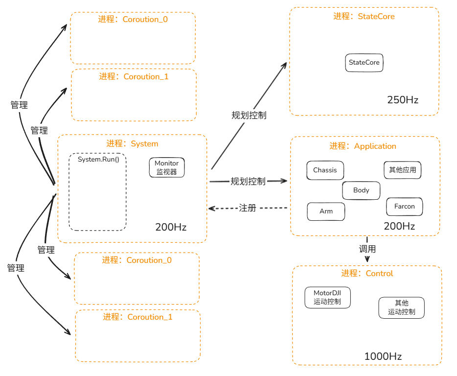

    
    

<h1>Reactor70 电控框架</h1>

# 简介
> [!TIP]
> 项目已更名为 `Reactor70`  
> 本框架为 原框架 [`GeneralFramework`](https://github.com/njustup70/Reactor-46H/tree/master) 的 后继版本  
> 如需获取旧版本，请点击链接，切换到 原 `master` 分支
> > ***本架构仍在持续更新中！！！请积极提交 ISSUE 和 PR***

基于 ***DJI A Board*** 和 ***DJI C Board*** 搭建的电控框架库  
与大多数嵌入式框架一样分为 `Bsp`、`Module`、`Sys`、`App`层
框架使用 全`C++` 进行组织，并严格面向对象 

用户 ***无需更改*** App层以下的任何代码，只需要通过调用 / 编写 `Application` 即可实现逻辑

# 特性
- [简介](#简介)
- [特性](#特性)
  - [架构接口设计](#架构接口设计)
    - [系统架构图](#系统架构图)
  - [兼容性](#兼容性)
    - [工具链](#工具链)
    - [硬件底座](#硬件底座)
  - [安全性](#安全性)
    - [日志系统](#日志系统)
    - [监控系统](#监控系统)
    - [逐步解耦](#逐步解耦)
  - [用户体验](#用户体验)
    - [易于使用](#易于使用)

## 架构接口设计
本框架 ***完全兼容*** 了 `V 1.0.x` 的设计语言，并在此基础上进行了一些改进  
原有的用户代码几乎可以 **无缝地** 衔接到新框架中，仍然采用经典的四层架构设计

同时，系统运行的模块设计也完全一致
### 系统架构图

    

## 兼容性
得益于 `Reactor70` ***硬件无关*** 的设计思路，框架具有极强的 兼容性 和 移植性
### 工具链
- *兼容* `Keil Assistant` 工具链
- *兼容* `OpenOCD` 工具链
> 通过 `sync_keil.py` 脚本，用户可以轻松地将 `CMake` 编译链条 一键同步到 `Keil` 工程中，实现两者的无缝切换

### 硬件底座
- 具有极强的移植性，能够在改动硬件的前提下，***完全不改动用户代码***  
只需要通过 *简单的移植工作*，即可在新的硬件平台上启动。

- **不再含有** 任何与 *硬件强绑定* 的代码，包括常见的 `uproject` 文件和 `CubeMX.ioc` 文件等

> [!WARNING]
> 配置方法暂时未系统整理，请参考 ***队伍文档***

## 安全性
### 日志系统
> [!IMPORTANT]
> 通过修复了串口库的连续发送BUG，框架现在拥有了一个 稳定、可靠、易用 的日志系统

### 监控系统
系统的监控系统逻辑已经被重构，现在各应用模块的监控行为是完全 **分布式** 进行的

### 逐步解耦
框架将在数个版本后，逐步完全解除中上层的HAL库污染；  
当前，`UART`、`CAN`等模块的接口已经完全解耦。

## 用户体验
### 易于使用
内部具有 ***完整的库封装***，用户无需关心底层细节，直接调用接口即可实现功能  
***完全的*** 面向对象，纯 `C++` 设计，编程体验极佳

Authors and Contributors (At least 5 commits) 
<---*------*------*------*------*------*------*------*---> 
Huangney, Agilawood1

